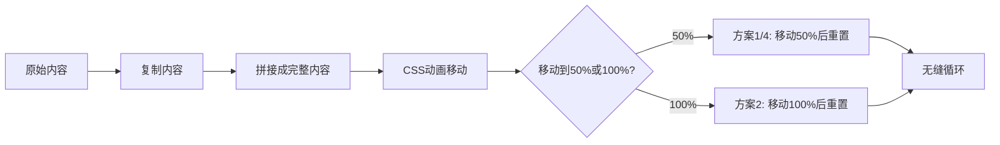
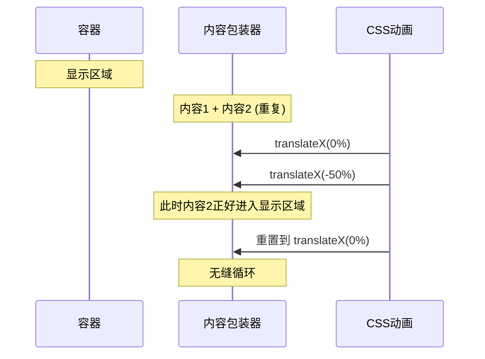
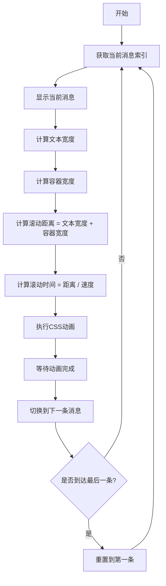

# 无缝走马灯演示

一个展示4种不同无缝滚动走马灯实现方案的演示项目。所有方案都支持根据数据动态渲染内容。

## 📋 目录

- [功能特点](#功能特点)
- [四种方案对比](#四种方案对比)
- [快速开始](#快速开始)
- [方案详解](#方案详解)
- [技术原理](#技术原理)
- [使用示例](#使用示例)

## ✨ 功能特点

- ✅ 4种不同的无缝滚动实现方案
- ✅ 所有内容根据 `map` 数组动态渲染
- ✅ 纯 CSS + JavaScript 实现，无需依赖
- ✅ 支持任意数量的消息内容
- ✅ 无缝循环，无卡顿感

## 🎯 四种方案对比

| 方案 | 特点 | 适用场景 | 实现复杂度 |
|------|------|----------|------------|
| **方案1** | 内容重复，CSS padding 控制间距 | 需要灵活间距控制 | ⭐⭐ |
| **方案2** | 双重内容交替，分隔符分隔 | 需要明确分隔符 | ⭐⭐⭐ |
| **方案3** | 智能切换，单条滚动 | 需要逐条显示 | ⭐⭐⭐⭐ |
| **方案4** | 简单拼接，文本连接 | 最简单的实现 | ⭐ |

## 🚀 快速开始

1. 直接打开 `index.html` 文件即可查看演示
2. 修改 `map` 数组来更新显示内容：

```javascript
var map = ['剩余时长: 05 小时 20 分钟', '包月截止时间：2022 年 05 月 21 日', '公告：张士超你把我的钥匙藏哪啦'];
```

## 📖 方案详解

### 方案1：内容重复无缝滚动

**原理**：将所有消息拼接成一串，然后复制一份，通过 CSS 动画实现无缝循环。

**特点**：
- 使用 `padding-right` 控制消息间距
- 动画移动 50% 距离后无缝衔接
- 所有内容连续滚动，永不停歇

**HTML 结构**：
```html
<span class="item-seamless">消息1</span>
<span class="item-seamless">消息2</span>
<span class="item-seamless">消息3</span>
<!-- 重复一次 -->
```

### 方案2：双重内容交替

**原理**：两组完全相同的内容首尾相连，当第一组滚出时第二组正好进入。

**特点**：
- 使用分隔符 `|` 分隔内容
- 动画移动 100% 距离后无缝衔接
- 双重内容确保无缝衔接

**HTML 结构**：
```html
<span class="content-double">消息1</span>
<span class="separator">|</span>
<span class="content-double">消息2</span>
<span class="separator">|</span>
<!-- 重复一次 -->
```

### 方案3：智能切换滚动

**原理**：每条消息滚动完成后立即切换到下一条并开始滚动。

**特点**：
- 动态计算文本宽度和滚动时间
- 保持恒定滚动速度（50像素/秒）
- 显示当前滚动状态

**执行流程**：
1. 显示当前消息
2. 计算文本宽度和容器宽度
3. 根据距离和速度计算滚动时间
4. 执行滚动动画
5. 动画结束后切换到下一条消息

### 方案4：简单拼接滚动

**原理**：所有内容用分隔符连接成一条长文本，重复2次无缝滚动。

**特点**：
- 最简单的实现方式
- 使用 `join(' | ')` 连接所有内容
- 复用方案1的 CSS 样式

**生成文本**：
```
消息1 | 消息2 | 消息3 | 消息1 | 消息2 | 消息3
```

## 🔧 技术原理

### 无缝滚动的核心原理

所有无缝滚动方案都基于同一个核心思想：**内容重复 + 动画循环**



### 方案1和方案4的动画原理



### 方案2的动画原理


### 方案3的执行流程



## 💡 使用示例

### 修改显示内容

在 `index.html` 中找到 `map` 变量，修改数组内容：

```javascript
var map = [
  '剩余时长: 05 小时 20 分钟',
  '包月截止时间：2022 年 05 月 21 日',
  '公告：张士超你把我的钥匙藏哪啦',
  '新消息：可以添加任意数量的消息'
];
```

### 自定义样式

修改 CSS 变量来调整外观：

```css
.container {
  width: 400px;        /* 容器宽度 */
  background: rgb(0, 0, 0);  /* 背景色 */
  color: rgb(255, 255, 255); /* 文字颜色 */
}

.wrap-seamless {
  animation: scroll-left 15s linear infinite; /* 动画时长 */
}

.item-seamless {
  padding-right: 100px; /* 消息间距 */
}
```

### 调整滚动速度

**方案1、2、4**：修改动画时长
```css
animation: scroll-left 15s linear infinite; /* 数值越小，速度越快 */
```

**方案3**：修改速度常量
```javascript
const speed = 50; // 50像素/秒，数值越大，速度越快
```

## 🎨 方案选择建议

- **需要最简单的实现** → 选择方案4
- **需要灵活控制间距** → 选择方案1
- **需要分隔符分隔** → 选择方案2
- **需要逐条显示，有状态提示** → 选择方案3

## 📝 注意事项

1. 所有方案都需要内容重复至少2次才能实现无缝效果
2. 方案3会根据文本长度动态计算滚动时间，确保每条消息完整显示
3. 修改 `map` 数组后，所有方案会自动更新显示内容
4. 建议在浏览器控制台查看生成的 HTML 结构，便于调试

## 🔍 调试技巧

代码中已经添加了 `console.log` 输出，可以在浏览器控制台查看：
- 方案1生成的 HTML 结构
- 方案2生成的 HTML 结构
- 方案4生成的文本内容

打开浏览器开发者工具（F12），切换到 Console 标签页即可查看。

## 📄 许可证

本项目采用 MIT 许可证。
