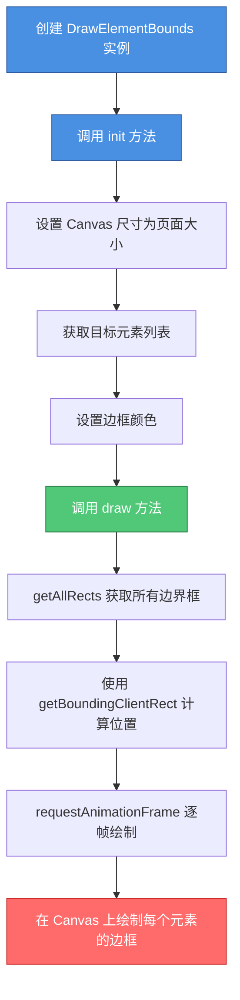

# Draw HTML Box

一个用于在 Canvas 上绘制页面上所有 HTML 元素边界框的工具。可以帮你可视化页面上每个元素的实际占用空间，非常适合调试布局问题。

## 功能特点

- 🎨 在 Canvas 上绘制所有元素的边框
- 🎯 支持自定义目标元素选择器
- 🌈 支持自定义边框颜色
- ⚡ 使用 `requestAnimationFrame` 优化绘制性能
- 🧹 提供清除画布的方法

## 快速开始

### 1. 引入脚本

```html
<canvas id="myCanvas" class="canvas"></canvas>
<script src="./draw.js"></script>
```

### 2. 基本使用

```javascript
// 创建实例
var drawElementBounds = new DrawElementBounds();

// 初始化配置
drawElementBounds.init({
  ele: '#myCanvas',  // canvas 元素选择器
  color: 'red'       // 边框颜色（可选，默认黄色）
});

// 页面加载完成后开始绘制
window.onload = () => {
  drawElementBounds.draw();
};
```

### 3. 完整示例

```html
<!DOCTYPE html>
<html>
<head>
  <style>
    .canvas {
      position: absolute;
      left: 0;
      top: 0;
      z-index: 1;
      pointer-events: none; /* 让 canvas 不阻挡鼠标事件 */
    }
  </style>
</head>
<body>
  <div>
    <h1>标题</h1>
    <p>内容</p>
  </div>
  
  <canvas id="myCanvas" class="canvas"></canvas>
  <script src="./draw.js"></script>
  <script>
    var drawElementBounds = new DrawElementBounds();
    drawElementBounds.init({ ele: '#myCanvas', color: 'red' });
    
    window.onload = () => {
      drawElementBounds.draw();
    };
  </script>
</body>
</html>
```

## API 文档

### `new DrawElementBounds()`

创建 DrawElementBounds 实例。

### `init(options)`

初始化配置。

**参数：**
- `ele` (string, 必填) - Canvas 元素的选择器，如 `'#myCanvas'`
- `target` (array, 可选) - 要绘制的目标元素选择器数组。如果不传，默认绘制页面上所有元素
- `color` (string, 可选) - 边框颜色，默认 `'yellow'`

**示例：**

```javascript
// 绘制所有元素
drawElementBounds.init({ 
  ele: '#myCanvas', 
  color: 'red' 
});

// 只绘制特定元素
drawElementBounds.init({ 
  ele: '#myCanvas', 
  target: ['div', 'p', 'h1'],  // 只绘制 div、p、h1 元素
  color: 'blue' 
});
```

### `draw()`

开始绘制所有元素的边界框。使用 `requestAnimationFrame` 逐帧绘制，避免一次性绘制过多导致页面卡顿。

### `clear()`

清除画布上的所有内容。

**示例：**

```javascript
// 清除画布
drawElementBounds.clear();

// 重新绘制
drawElementBounds.draw();
```

### `getAllRects()`

获取所有目标元素的边界框信息。返回一个包含 `{x, y, width, height}` 对象的数组。

## 工作原理



## 使用场景

- 🔍 **调试布局问题** - 快速查看每个元素的实际占用空间
- 📐 **学习 CSS 盒模型** - 可视化理解元素的盒模型
- 🎨 **设计审查** - 检查元素间距和对齐
- 🐛 **排查样式问题** - 发现意外的元素重叠或错位

## 注意事项

1. Canvas 需要设置为绝对定位，覆盖在整个页面上
2. 建议给 Canvas 添加 `pointer-events: none` 样式，避免阻挡页面交互
3. 如果页面元素很多，绘制可能需要一些时间
4. 绘制完成后会在控制台输出 "dom元素遍历完了"

## 浏览器兼容性

支持所有现代浏览器（Chrome、Firefox、Safari、Edge）。
