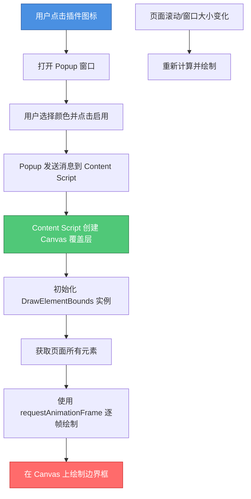

# Draw HTML Box 浏览器插件

将 Draw HTML Box 功能打包成浏览器插件，可以在任意网页上可视化 HTML 元素的边界框。

## 功能特点

- 🎨 在任意网页上绘制所有元素的边框
- 🎯 支持自定义边框颜色
- ⚡ 实时响应页面滚动和窗口大小变化
- 🧹 一键开启/关闭绘制功能
- 🎛️ 简洁的 Popup 控制界面

## 安装步骤

### 1. 生成图标（首次安装需要）

打开 `generate-icons.html` 文件，点击按钮下载三个尺寸的图标文件，保存到 `icons` 目录：
- `icon16.png` (16x16)
- `icon48.png` (48x48)
- `icon128.png` (128x128)

或者你可以使用自己的图标文件，只要文件名和尺寸匹配即可。

### 2. 加载插件到 Chrome/Edge

1. 打开 Chrome 或 Edge 浏览器
2. 访问 `chrome://extensions/` 或 `edge://extensions/`
3. 开启右上角的"开发者模式"
4. 点击"加载已解压的扩展程序"
5. 选择 `extension` 文件夹
6. 插件安装完成！

### 3. 使用插件

1. 访问任意网页
2. 点击浏览器工具栏中的插件图标
3. 在弹出窗口中：
   - 选择边框颜色（可以使用颜色选择器或输入颜色值）
   - 点击"启用绘制"按钮
4. 页面上会显示所有 HTML 元素的边界框
5. 再次点击"禁用绘制"可以关闭绘制功能

## 文件结构

```
extension/
├── manifest.json          # 插件配置文件
├── draw.js                # 核心绘制类
├── content.js             # 内容脚本（注入到页面）
├── popup.html             # 弹出窗口界面
├── popup.js               # 弹出窗口脚本
├── icons/                 # 图标目录
│   ├── icon16.png
│   ├── icon48.png
│   └── icon128.png
├── generate-icons.html    # 图标生成工具
└── README.md              # 本文件
```

## 工作原理



## 技术实现

### Content Script
- 在页面中注入 Canvas 覆盖层
- 监听来自 Popup 的消息
- 管理绘制功能的开启/关闭
- 响应页面滚动和窗口大小变化

### Popup
- 提供用户界面控制插件
- 颜色选择器
- 状态显示
- 与 Content Script 通信

### 消息传递
使用 Chrome Extension Message API 在 Popup 和 Content Script 之间通信：
- `toggle`: 切换绘制状态
- `enable`: 启用绘制
- `disable`: 禁用绘制
- `getStatus`: 获取当前状态

## 注意事项

1. 插件需要在页面加载完成后才能正常工作
2. 如果页面使用了 iframe，可能需要额外的权限
3. 某些受保护的页面（如 `chrome://` 页面）可能无法使用
4. Canvas 使用 `pointer-events: none` 避免阻挡页面交互

## 浏览器兼容性

- Chrome 88+
- Edge 88+
- 其他基于 Chromium 的浏览器

## 开发说明

如果需要修改插件：

1. 修改代码后，在 `chrome://extensions/` 页面点击插件的"重新加载"按钮
2. 刷新目标网页以应用更改
3. 使用浏览器开发者工具调试 Content Script（在页面上下文中）

## 许可证

与原项目保持一致。
